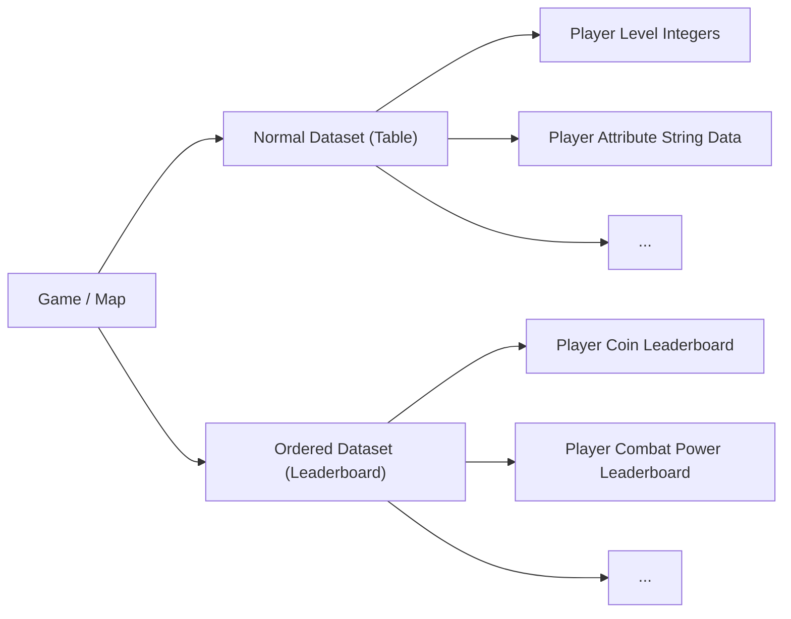
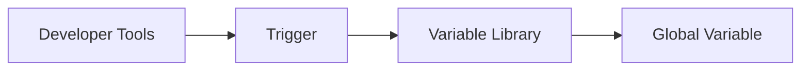

# Mini World UGC 3.0 Lua Scripting Reference

## Overview

- If you are unsure about an API name or constant, use the official common interface. Do not invent non-existent functions, constants, or other identifiers.
- `Trigger` refers to the graphical programming system of `UGC 3.0`.
- `Cloud Server` refers to the official server allocated to UGC content.
- MiniUGC's Lua is based on Lua 5.1.
- For specific interfaces, refer to `MNDeclaration.d.lua` or `MNAiDesc.txt`.

## Script Boilerplate

Every script **must** begin and end with the following structure:

```lua
local Script = {}
  -- your code
return Script
```

## Script Entry Point

```lua
function YourTableName:OnStart()
end
```

> `OnStart` is the **first function to run** — it is the script's **main entry point**.

- Note: You cannot set a metatable on your component table itself, but other tables can have metatables.

## OnTick

```lua
function Script:OnTick(dt)
  -- Called on every tick
end
```

## Component Destruction Callback

```lua
function Script:OnDestroy()
  -- Executed when the component is destroyed
end
```

## Language Features

- UGC supports the `goto` statement.
- `pcall()` is available.
- The `debug` library has been trimmed down.

## UGC API Calls

There are two calling conventions:

- `ClassName:APIName(...)`
- `APIName(...)`

Example 1:

```lua
CustomUI:HideElement(1001, "114-514", "114-514_1")
```

Example 2:

```lua
GetWorld()
```

- Tip: You can localize a global API to a local variable for better performance.

## The `os` Library

In UGC, only `time()`, `timeMs()`, and `data()` are available from the `os` library.

## Resource Cleanup on Player Exit

When a player exits the game, `UGCS` automatically releases most of the resources directly tied to that player:

1. Opened UIs and UI elements
2. Event listeners and timers
3. ...and so on

When all players have exited, the cloud server shuts down after a period of time and releases all remaining resources.

## Player ID (Uin)

A player's ID is their Mini number — a string of digits.

## Event Registration / Removal

These functions only take effect inside `UI` and `World Component` scripts.

### Registration and Removal

| Operation | Method | Parameters | Return | API Call | Notes |
| :-: | :-: | :-: | :-: | :-: | :-: |
| Register Event | Method 1 | event type: string, callback: function, filter param 1 (optional): number/string, filter param 2 (optional): number/string | None | `self:AddTriggerEvent(eventEnum, callback, filter1, filter2)` | Only listens to official trigger events |
| Register Event | Method 2 | event type: string, callback: function, priority (optional): number, filter param 1 (optional): number/string, filter param 2 (optional): number/string | None | `self:AddEvent(eventEnum or customBroadcast, callback, priority, filter1, filter2)` | Listens to both official component events and custom broadcasts |
| Remove Event | Method 1 | event type: string | None | `self:RemoveTriggerEvent(eventEnum)` | — |
| Remove Event | Method 2 | event type: string | None | `self:RemoveEvent(eventEnum or customBroadcast)` | — |

### Event Enums

For event enums, refer to the following entries in `MNDeclaration.d.lua`:

| Name |
| :-: |
| TriggerEvent |
| CurEventParam |
| ObjectEvent |

### Event Callback Functions

The callback receives a single `event` parameter (a table containing event information; you may rename it to any valid identifier). It is usually non-`nil`, so a nil check is generally unnecessary.

Example:

```lua
local Script = {}

function Script:OnStart()
  self:AddTriggerEvent(TriggerEvent.PlayerClickBlock, self.OnPlayerClickBlock) -- register event
end

function Script:OnPlayerClickBlock(event) -- player click block callback
  local block, playerUin = event.blockid, event.eventobjid
  print("Player [".. playerUin .."] clicked block, type ID: ".. block)
end

return Script
```

## Broadcast Messages: Send / Subscribe / Unsubscribe

- **Message ID**: You must first define the message (broadcast) in the trigger UI to obtain the system-generated ID.
- **Parameter types and count** must match those defined in the trigger's broadcast.

| Operation | Type | Parameters | Return | API Call | Notes |
| :-: | :-: | :-: | :-: | :-: | :-: |
| Async broadcast | Async | message ID: string, N params | None | `self:PushCustomEvent(msgID, ...)` | — |
| Sync broadcast | Sync | message ID: string, N params | None | `self:PushCustomEventSync(msgID, ...)` | — |
| Subscribe | — | event type: string, callback: function, priority (optional): number, filter param 1 (optional): number/string, filter param 2 (optional): number/string | None | `self:AddEvent(eventEnum or customBroadcast, callback, priority, filter1, filter2)` | Listens to both official events and custom broadcasts |
| Unsubscribe | — | event type: string | None | `self:RemoveEvent(eventEnum or customBroadcast)` | Removes listeners for both official events and custom broadcasts |
| Cloud server async broadcast | Async | message ID: string, N params | None | `self:PushCloudServerMsg(msgID, ...)` | Only components listening on the same object receive the event |
| Subscribe to cloud server broadcast | — | event type: string, callback: function | None | `self:AddCloudSeverEvent(eventEnum or cloudBroadcast, callback)` | — |
| Unsubscribe from cloud server broadcast | — | event type: string | None | `self:RemoveCloudSeverEvent(eventEnum or customBroadcast)` | — |

## Coordinate System

The coordinate system uses `X Y Z`:

- **X**: increases toward East, decreases toward West
- **Y**: increases upward, decreases downward
- **Z**: increases toward North, decreases toward South

## Skybox / Environment Settings

The environment (skybox) controls the world's visual atmosphere — sky color, lighting, clouds/fog, water, sun, moon, and other effects.

Unlike filters, which modify the **rendered image**, the environment modifies the **world's own scenery**. Both can be used together.

You can apply an environment preset with a one-click template, or fine-tune parameters for a specific time segment individually.

### Templates

| ID | Name | Style / Mood |
| :-: | :-: | :-: |
| 0 | Empty | Environment disabled |
| 1 | Classic | Generic realistic daytime |
| 2 | Cartoon | Cartoon, cute, bright |
| 3 | Natural Transition | Natural, realistic, soft |
| 4 | Dreamy Pink | Dreamy pink, aesthetic |
| 5 | Ice Blue | Ice/snow, cold tone |
| 6 | Flame Red | Burning red, dangerous |
| 7 | Wasteland Yellow | Wasteland, desolate, post-apocalyptic |
| 8 | Sci-fi Gray | Sci-fi cyberpunk, cold tone |
| 9 | Toxic Green | Toxic fog, eerie green |
| 10 | Ink Wash | Chinese ink wash, black & white |
| 11 | Green Mountains | Chinese ink wash, cyan-green |
| 12 | Forest | Forest green, natural |
| 13 | Desert | Desert, arid, warm yellow |
| 14 | Ice Field | Ice field, cold, white |
| 15 | Swamp | Swamp, damp, dark green |
| 16 | Volcano | Volcano, hot, red-black |
| 17 | Rainforest | Rainforest, humid, deep green |
| 18 | Jungle | Jungle, dense green |
| 19 | Taiga | Taiga, cold green, high latitude |
| 20 | High Mountain | Alpine, lofty, cold blue |
| 21 | Ocean | Ocean, blue, open |
| 22 | Sky Island | Floating sky island |
| 23 | Basin | Basin, lowland, soft |
| 24 | Grassland | Grassland, open, green-yellow |
| 25 | Savanna | Savanna, tropical, warm yellow-green |
| 26 | Glowing Sky Island | Glowing, fantasy, vivid |

### Time Segments

| Segment | Approx. Hour | Mood |
| :-: | :-: | :-: |
| Midnight | 0h | Late night / darkest |
| Pre-dawn | 4h | About to brighten |
| Sunrise | 6h | Glow on the horizon |
| Morning | 8h | Bright and fresh |
| Noon | 12h | Brightest |
| Afternoon | 16h | Warm tinted |
| Dusk | 18h | Sunset / orange-red |
| Night | 20h | After dark / starry |

### Example

```lua
local Script = {}

function Script:OnStart()
  World:SetSkyBoxTemplate(1)                                            -- switch to "Classic" environment template
  World:SetSkyBoxColor(SkyboxTime.TimeAll, SkyboxColor.Top, 0x87CEEB)   -- set top sky color for the whole day to light blue
  World:SetSkyBoxAttr(SkyboxTime.TimeAll, SkyboxAttr.CloudDensity, 50)  -- set cloud density for the whole day
  World:SetSkyBoxSwitch(SkyboxTime.TimeAll, SkyboxSwitch.Fogenable, 1)  -- enable fog
end

return Script
```

## Component Interop

**Component A:**

```lua
local Script = {}
Script.openFnArgs = {
  Add = {
    returnType = Mini.Number,
    displayName = "Alias",
    params = {Mini.Number, Mini.Number},
  }
}

-- Function definition example
function Script:Add(a, b)
  if a and b then
    return a + b
  end
end

-- Called when the component starts
function Script:OnStart()
  -- Example: calling a function defined on the current component.
  -- Note: calling functions on the current component requires no extra configuration.
  local result = self:Add(1, 2)
  print("result", result)
end

return Script
```

**Component B:**

```lua
local Script = {}
function Script:OnStart()
  -- Same-object operation

  -- Get component A on this object
  local cmpA = self:GetComponent("component id")

  -- Call component A's function
  local result = cmpA:Add(1, 2)
  print("result", result)

  -- Cross-object operation
  local obj   = GameObject:FindObject("object id") -- get a general object
  local world = GetWorld()                          -- how to obtain the world object

  -- Get component A on the world object
  local cmpA = world:GetComponent("component id")

  -- Call component A's function
  local result = cmpA:Add(1, 2)
  print("result", result)

  local age  = cmpA.age   -- read cmpA's age property
  cmpA.age   = 123        -- set cmpA's age property to 123
end
return Script -- return the table that defines the component
```

## Yielding (Wait)

**Method 1:**

```lua
self:ThreadWait(time)
```

**Method 2:**

```lua
threadpool:wait(time)
```

- Note: The default wait is one frame; `0s` also counts as one frame. All wait functions work in any valid context.
- Note: Waiting does **not** freeze the game or block player input. It only blocks the Lua thread — i.e., Lua logic is paused.

## Starting a New Coroutine

```lua
self:ThreadWork(function()
  print("Start")
end)
```

## Modules and Packages

Native `require` and `module` syntax are not supported, and you cannot interoperate with C.

## UI

- **UI Element**: an element inside a `UI` (such as a button or image). Types include `Image`, `Button`, `Scroll Container`, `Input Box`, `Progress Bar`, `3D Model Loader`, and `Text`.
- UI elements have a parent/child hierarchy. Deleting a parent element also deletes its children.
- `Font Stroke`, `Font Shadow`, `Text Horizontal Alignment`, and `Text Vertical Alignment` cannot be modified through the `CustomUI API` at this time.

| UI Element | Properties |
| :-: | :-: |
| Common | `Position X`, `Position Y`, `Height`, `Width`, `Angle`, `Color`, etc. |
| `Image` & `Button` | `Image` |
| `Scroll Container` | `Scroll Direction`, `Scrollbar Image`, etc. |
| `3D Model Loader` | `Model`, etc. |
| `Text` | `Text`, `Font Stroke`, `Font Shadow`, `Text Horizontal Alignment (Left/Center/Right)`, `Text Vertical Alignment (Top/Center/Bottom)`, etc. |

### UI and Element IDs

- A UI's ID is a string of digits (e.g., `"114514-64940"`). An element's ID is `UI ID + _index` (e.g., `"114514-64940_2"`).
- After an element is deleted and re-created, its ID index increments (the example above becomes `"114514-64940_3"` after rebuild).

### Element Cloning

Use the `CloneElement` function from the `CustomUI API` to clone an element.

A cloned element's ID is `original element ID + #clone + count`.

- Example: `"114514-64940_2#clone1"`

When the cloned element is a parent, the corresponding children are also cloned.

- Example:
  - Before cloning:
    - Parent: `"114514-64940_2"`
    - Child: `"114514-64940_3"`
  - After cloning:
    - Parent: `"114514-64940_2#clone1"`
    - Child: `"114514-64940_3#clone1"`

### Element Creation

Use the `CreateElement` function from the `CustomUI API` to create a new element.

A created element's ID is `UI ID + _new + count`.

- Example: `"114514-64940_new1"`

To change an element's parent, use the `ChangeParent` function from the `CustomUI API`.

### Setting Element Properties

> Element properties must be set through the `CustomUI API`.

## Log Output

Use `print()` or `printError()` for log output.

## Lua Script Variables vs Trigger Variables

If you want to create player-private variables in Lua, you must implement them yourself (e.g., a player data manager). In triggers, this is not required.

Variable ID format: `v + a string of digits`.

### Reading Trigger Variables in Lua

There are three variable categories in triggers:

| Name | Description |
| :-: | :-: |
| Public Variable | Shared by all players |
| Private Variable | Personal data associated with a player, stored independently |
| Component Variable | Configurable parameters that come with a component |

Reading trigger variables requires the `Data`, `Array`, `Table`, or `Map` API.

To obtain a trigger variable's ID: retrieve it from the trigger UI.

### Leaderboards & K/V Data

#### K/V Data

A general-purpose data store. It acts like a table that can hold any type of data, and you can store multiple tables keyed by different `Key`s.

Each value in the store is indexed by a key, and any value can be added under it. One `Key` maps to exactly one `Value`. A `Value` can be a number, a string, a JSON string, and so on. For example, player-related data can be stored as:

| KEY | VALUE |
| :-: | :-: |
| level | `50` |
| attr | `{ "flowers": 100, "level": 6, "vip": 3, "played_count": 13, "label": "Pro" }` |
| coin | `78000` |

> Using the same dataset name and key, you can read and write data.

#### Leaderboard Data

An ordered data set. The stored data type is numeric, and the system sorts automatically by value, so we call it leaderboard data. It can store multi-dimensional data for automatic sorting.

1. A leaderboard can hold the data of the top 1000 players on a map, enabling a map-wide leaderboard feature.
2. The default sort order is ascending. When reading data with `Get`, positive numbers mean ascending and negative numbers mean descending.
3. A leaderboard can only store positive integers; the integer part of any decimal is taken.

Basic leaderboard format:

| KEY (playerUin) | VALUE |
| :-: | :-: |
| 100001 | 114514 |
| 100002 | 1919810 |
| 100003 | 123 |



#### Data Storage Lifecycle

1. Once a map passes review and its status is active, the data stored in it is valid.
2. If the map upload is canceled, the data is retained for 30 more days. If the map is not re-uploaded within 30 days, the data is permanently cleared and cannot be recovered.
3. If the developer actively calls the delete API, or the map is deleted, the data is permanently cleared and cannot be recovered.

> - Note: In multiplayer or single-player mode, this feature only provides temporary storage for the current map and current room. Data is lost when the room closes.
> - Note: To verify data storage correctness, you must be in a **cloud server environment (inside a cloud server room)** to correctly retrieve the stored data. In single-player or multiplayer mode, you cannot retrieve any cloud server data.

#### How to Enable `K/V Storage` and `Leaderboards`

Flow:



Types:

- Leaderboard
- K/V Table

For `I/O` operations on leaderboards and tables, refer to the `Map` API.

#### Storage Limits

The per-game server request cap is dynamically allocated based on the **number of online players**, allowing a certain amount of data `I/O` requests. More players means a higher quota and more data.

Details (`numPlayers` is the player count):

| Request Type | Function | Per-Minute Request Cap | Notes |
| :-: | :-: | :-: | :-: |
| Set | `SetValueAndCallBack(...)` / `SetValueAndBlock(...)` / `RemoveValueAndCallBack(...)` / `RemoveValueAndBlock(...)` / `UpdateValueAndCallback(...)` | 30 + numPlayers × 10 | Per-minute invocation limit. Requests beyond the cap will be throttled. |
| Get | `GetValueAndCallBack(...)` / `GetValueAndBlock(...)` | 30 + numPlayers × 10 | Combined per-minute invocation count of these functions must not exceed the cap, otherwise requests will be throttled. |
| Ordered Dataset | `GetIndexValueAndBlock(...)` / `GetNumValuesAndCallback(...)` / `GetRangeValuesAndCallback(...)` / `ClearData(...)` | 5 + numPlayers × 2 | Combined per-minute invocation count of these functions must not exceed the cap, otherwise requests will be throttled. |

#### Data Length Limits

Besides request frequency, data storage also limits the amount of data per entry. The `key`, `name`, and `data` must each be within a certain character length, and total stored data is also limited.

Specific limits:

| Component | Max Characters | Notes |
| :-: | :-: | :-: |
| Key | `50` | Recommended within `50 characters` |
| Name | `50` | Recommended within `50 characters` |
| Data | `2,000,000` | Recommended within `2,000,000 characters` |

> Because `key` and `name` are strings, you can use `string.len()` to check their length. Data is also stored as a string in the data store regardless of its initial type. You can use the `JSONEncode()` function (which serializes a Lua table to a JSON string) to check the size of the data.

#### Global K/V Data Concurrent Read/Write

Global `K/V data` concurrent read/write ensures uniqueness when multiple players perform `I/O` operations on the same `KEY` at the same time — guaranteeing successful reads/writes and that the latest value is obtained.

**Application scenarios** — including but not limited to clan systems, auction house systems, and flash-sale systems. Developers may choose to use it based on their own business needs.

> The regular `SetValueAndBlock` and `SetValueAndCallBack` interfaces already satisfy the **vast majority** of `K/V data` `I/O` needs. However, when implementing large cross-game-room features such as a server-wide clan system (global properties like total member count / contribution points) or a server-wide auction house (remaining quantity of items for sale), data can easily be overwritten by each other, **failing to guarantee global uniqueness.**

To guarantee global uniqueness:

> The `UGC system` provides the new `UpdateValueAndCallback(...)` interface. With this interface, developers only need to handle a **callback function** and process their data logic inside it. The underlying interface will automatically retry **until the data modification succeeds.**

- **Note: This interface only works on the cloud server. Do not test it in single-player or multiplayer mode!**

> In the event of a **conflict** or **failure**, the interface automatically returns the latest data value and invokes the developer's callback, updating the data according to the developer's own logic. This **ensures the data is correct** and **will not be overwritten by other players.**

##### Callback Function Example

`UpdateValueAndCallback(...)`

Parameters and types:

| Parameter | Type | Notes |
| :-: | :-: | :-: |
| varId | string | K/V table variable ID |
| playerId | number | Player Uin |
| key | string | Key (numbers are converted to strings) |
| value | string / number / boolean | The actual value |

Return value:

- Type: `boolean`
- Indicates whether the call was successful.

Main purpose: safely update the value under a `key` in the table. Concurrent data access ensures the **uniqueness** of the value under that `Key`.

Example:

```lua
-- `code` has only two values: 0 and 2.
-- The callback is invoked at least twice. The first call always has code = 0, used to set the value.
-- On the 2nd or later calls: if the set failed, callback is invoked again with code = 0;
-- if it succeeded, code = ErrorCode.OK and no further sets are made.
local function GlobalKVCallback(code, key, value)
  Chat:SendChat(table.concat({"UpdateValueAndCallback code = ", tostring(code), "key = ", tostring(key), "value = ", tostring(value)}, " "))
  value = json.decode(value) or value
  print("code", code, "key", key, "value", value)

  if code == ErrorCode.KV_UPDATE_SET then            -- must return the final value to set
    value = value or {}
    value.updatevalue = 999
    return json.encode(value)                        -- must return the final value to set, serialized
  elseif code == ErrorCode.KV_UPDATE_GET then
    print("Latest value retrieved:", value)
  elseif code == ErrorCode.OK then
    print("Update complete")
  else
    print("Update failed")
  end
end

local result = Data.Map:UpdateValueAndCallback(GlobalKV, nil, "GlobalKV_Key2", GlobalKVCallback)

if result then
  print("Call succeeded")
else
  print("Call failed")
end
```

#### Normal K/V Storage vs Global K/V Concurrent Read/Write

- **Normal K/V**
  > A `Set` operation on Normal K/V storage is **faster**. It directly saves the data for a `Key` and is only subject to the per-minute request count limit at write time. However, when **multiple servers** write to the **same** `Key` at the same time, **data inconsistency can easily occur.**

- **Global K/V**
  > Global K/V concurrent read/write (`UpdateValueAndCallback(...)`) is slower because it reads the **latest** value before attempting to write. This interface is also subject to the per-minute `I/O` request count **limit**. In addition, on the **first operation** on a `Key`, since the data **does not exist**, an **empty value** is returned. This is still handled **inside the callback**, and the first valid data is submitted to the underlying layer there.

#### Notes

1. The `UpdateValueAndCallback(...)` interface **does not require** you to set the data for a `Key` in advance, because the data **is submitted inside the callback**. The first piece of data (from nothing to something) is also submitted there. This is what avoids mutual overwrites when operating on the same `Key` concurrently.
2. Do not use `UpdateValueAndCallback(...)` unless necessary — **performance is lower**. Only use this interface in business scenarios that must guarantee `uniqueness` and `correctness` when writing to the same `Key`.
3. Data modified with `UpdateValueAndCallback(...)` must not be re-set with the regular `SetValueAndBlock` interface. Doing so would directly overwrite the original data, failing to guarantee `uniqueness` and `correctness`, possibly causing other issues.
4. Mixing `SetValueAndBlock` and `UpdateValueAndCallback(...)` to store data on the same `Key` is forbidden.
5. This interface only works on the cloud server. Do not test it in single-player or multiplayer mode.
6. Each `Key` can only have one callback set, and once set, it cannot be modified casually.
7. For data operated on by the Update interface, the `Set` operation **must** happen **inside the callback**, and you must modify the latest returned `Value`. Never operate on data obtained via your own `Get` call — it can easily lead to data overwrites or errors.

#### Leaderboards & K/V Data — Q&A

**Q: A `Set` operation fails.**

A:

1. Avoid hitting the server **CD limit**. `Set` operations on the same `Key` **must** be spaced `>=6s` apart. Avoid multiple `Set`s on the same `Key` within the same second, which would cause data not to be saved successfully.
2. Avoid continuously issuing `Set` operations for **unchanged** data. Set a boolean flag like `needSave` on the data to be saved. When data changes, set it to `true`. In a periodic save, send a `Set` request only when `needSave` is `true`; otherwise, no request is needed.
3. Avoid binding real-time read/write operations to high-frequency player behaviors like walking or colliding. Otherwise, a single player may trigger **hundreds** of data read/write requests per second.
4. Avoid triggering the per-minute request count `QPM` limit.
5. Handle `Set` or `Get` failures properly. You can create a failed-request queue, retry at appropriate moments, and remove entries from the queue once they succeed.

**Q: Can a game have multiple leaderboards?**

A:

1. A game **can** include multiple leaderboards, such as: score leaderboard, boss-kill-count leaderboard, speed leaderboard, duration leaderboard, skill-points leaderboard, etc.
2. If there are multiple leaderboards in a game, each board's refresh time **should be staggered**.

**Q: How many ranks can a leaderboard hold at most?**

A:

1. A single leaderboard can store up to 10,000 entries.
2. It is recommended to display no more than `TOP30`, and **at most** the top `100`. The more ranks displayed and the more participants, the more **performance is affected**, causing slower responses. Make a reasonable trade-off at design time.

**Q: How to perform `Set` / `Get` operations reasonably?**

A:

1. Avoid zero/initial values participating in the ranking.
2. Avoid `Set`s for values below the bottom of the leaderboard.
3. Multi-dimensional ranking values can be serialized to JSON and stored in a single `K/V` entry to avoid multiple pulls.
4. Multiple leaderboards can be merged into one JSON and stored in a `K/V table`. The `Key` is the player Uin, and the `Value` is JSON:

   ```lua
   {"exp": 888999, "lvl": 7, "kmonster": 39}
   ```

5. Distinguish between module configuration and state data that needs to be persisted.

**Q: It is recommended NOT to put configuration files in the data store.**

A: General configuration can live in scripts or a global table. There is no need to store it in a `K/V table`.

Example:

```lua
"FindMaHongJun_5": { "questName": "FindMaHongJun_5", "questProg": 0, "questProgAll": 1, "questSta": "no" }
```

This can be simplified. Suppose TaskID `10086` represents this task, then:

```lua
"10086": [0, 1, 0]
```

- The 1st array element represents `questProg`, the 2nd represents `questProgAll`, and the 3rd represents `questSta`.

### 2D Table

2D table operations use the `Table` API.

A 2D table variable is a new variable type that stores data in **tabular form** and is very easy to use. When making RPG, tower defense, and other games that **require a lot of configuration**, you no longer need to create multiple arrays — a 2D table can do it quickly. 2D tables support **global variables** and **player variables**. Player 2D tables can be saved on the server by selecting "cloud variable" when creating the variable.

The **first time** you create a 2D table variable, you **must define the column fields first**. Click the `View/Edit` button to enter the 2D table editor.

2D table format definitions **only support** importing `.csv`, and the `.csv` must follow the specified format.

#### .csv Format

1. The **first row** holds field remarks, mainly used to describe the **field's purpose** to avoid confusion. Once remarks are filled in, you can more quickly determine a field's purpose during debugging or viewing. Remarks are optional and **may be empty**.
2. The **second row** holds the column names, used to distinguish different fields when editing and during logic calls. This row is **required** and **must be unique**.
3. The **third row** holds the column **type**. The system parses the values filled in below into different data types based on this type, so they can be better utilized in logic. The currently supported data types are listed below. Note that the data type is required and must **exactly match** the official definition, **otherwise it cannot be recognized**.
4. The **fourth row** and beyond hold the actual data rows.

| Parameter Type | Type Name | Reference Value |
| :-: | :-: | :-: |
| Number | number | 1 |
| 3D Position | position | 0\|7\|0 |
| String | string | Hello Mini World |
| Boolean | bool | 0 |
| Block Type | block | 100 |
| Item Type | item | 101 |
| Creature Type | actorid | 3400 |
| Effect Type | effectid | 1000 |
| Player | player | 1000077763 |
| Object Instance | objid | 154467589 |
| Image | image | 8_400415944_1642835210 |
| Color | color | #91b8b8 |

#### 2D Table — Q&A

- **Q1: Can I dynamically add columns at runtime?**
  - A1: No. All column data types must be defined in edit mode.
- **Q2: How many rows can I import at most?**
  - A2: Currently, a single table supports up to **2000 rows** of data.
- **Q3: Import says `Could not recognize a column's type`.**
  - A3: The supported data types are limited to the table above. Check whether your values match the official ones exactly.
- **Q4: Import says `Column names must be unique, please re-enter`.**
  - A4: Column names must be unique, otherwise the trigger cannot distinguish fields. Modify the table and retry.
- **Q5: Export says `Missing column name`.**
  - A5: Column names cannot be empty. Modify the table and retry.
- **Q6: Export says `Data in column X does not match the data type and has been set to empty`.**
  - A6: The data type and the value below must correspond. If the filled value cannot be parsed as the data type, the value is reset to empty.
- **Q7: Can a row of data be empty?**
  - A7: Yes. If it is set to empty, reading it will also return an empty value.
- **Q8: At runtime I see `Data exceeds the upper limit, please contact the developer`.**
  - A8: A single player's 2D table variables and other cloud variables are subject to a 64K total storage limit.
- **Q9: My data table is correct, but it says `Data does not match the type`.**
  - A9: This is a **bug** and will be fixed in the next version.

### Component Properties (Component Variables)

#### Component Property Storage and Access

- **Definition**: `YourTableName.propertys = {}`
- **Access**: via `self.propertyName`. Directly accessing `XXX.propertys.propertyName` is **incorrect**.
- **Cross-component access**: get the target component first, then access via `targetComponent.propertyName` (see [Component Interop](#component-interop)).

Example:

```lua
local Script = {}
Script.propertys = {
  a = {
    type = Mini.Bool,
    default = true,
    displayName = "Boolean",
    sort = 1,
    tips = "tip",
  },
}
return Script
```

#### Component Property Info

| Property Name | Type | Input Value | Special Identifiers |
| :-: | :-: | :-: | :-: |
| Mini.Number | Number | `number` | `minValue`, `maxValue`, `format`, `style`, `stride` |
| Mini.String | String | `string` | `multiLine`, `maxLength` |
| Mini.Bool | Boolean | `boolean` | None |
| Mini.Color | Color | `HEX` / `string` | None |
| Mini.Vec3 | Position | `3D coordinate XYZ` table | `displayNames`, `format`, `minValue`, `maxValue` |
| Mini.MobType | Creature Type | `official creature type ID` / `Prefab prefab ID` | None |
| Mini.Block | Block Type | `block ID` | None |
| Mini.Item | Item Type | `item ID` | None |
| Mini.Effect | Effect Type | `effect type ID` | None |
| Mini.Picture | Image | `image ID` | None |
| Mini.Buff | Status | `official status type ID` / `Prefab prefab ID` | None |
| Mini.Sound | Sound Effect | `official sound type ID` / `Prefab prefab ID` | None |
| Mini.Model | Appearance | `model ID` | None |

**Common identifiers:**

| Identifier | Description | Example Value | Required |
| :-: | :-: | :-: | :-: |
| type | Type | `Mini.Number` | Yes |
| default | Default value | `100` | No |
| displayName | Property alias | `Number` | No |
| sort | Property sort order | `1` | No |
| tips | Property tip | `Meow` | No |

**Mini.Number special identifiers:**

| Identifier | Description | Example Value | Required |
| :-: | :-: | :-: | :-: |
| minValue | Minimum value | `-1000` | No |
| maxValue | Maximum value | `1000` | No |
| format | Unit (`%.0f`: integer, `%.1f`: one decimal) | `%.0f m` | No |
| style | Property control style | `ComponentUIStyle.NumberSlider` | No |
| stride | Step size (used in the property panel) | `1` | No |

Related enums (style):

| Style Enum | Description |
| :-: | :-: |
| ComponentUIStyle.NumberSlider | Slider |
| ComponentUIStyle.NumberButton | Button |
| ComponentUIStyle.NumberOnlyInput | Input box |

**Mini.String special identifiers:**

| Identifier | Description | Example Value | Required |
| :-: | :-: | :-: | :-: |
| multiLine | Allow multiline | `true` | No |
| maxLength | Max X characters | `10` | No |

**Mini.Vec3 special identifiers:**

| Identifier | Description | Example Value | Required |
| :-: | :-: | :-: | :-: |
| displayNames | Property aliases (defaults to X, Y, Z) | `{"Yaw", "Pitch", "Roll"}` | No |
| format | Unit (`%.0f`: integer, `%.1f`: one decimal) | `%.0f` | No |
| minValue | Minimum value | `{-100, -200, -300}` | No |
| maxValue | Maximum value | `{100, 200, 300}` | No |

Example:

```lua
Script.propertys = {
  numberAttr = {
    type = Mini.Number,
    default = 100,
    displayName = "Number",
    sort = 1,
    minValue = -1000,
    maxValue = 1000,
    format = "%.0f m",
    style = ComponentUIStyle.NumberSlider,
    stride = 1,
    tip = "tip",
  },
  stringAttr = {
    type = Mini.String,
    default = "Hello",
    displayName = "String",
    sort = 2,
    multiLine = false,
    maxLength = 10,
  },
  boolAttr = {
    type = Mini.Bool,
    default = true,
    displayName = "Boolean",
    sort = 3,
  },
  colorAttr = {
    type = Mini.Color,
    default = 0xFFFFFF,
    displayName = "Color",
    sort = 4,
  },
  vec3Attr = {
    type = Mini.Vec3,
    default = Mini.Vec3(0, 0, 0),
    displayName = "Position",
    displayNames = {"yaw", "pitch", "roll"},
    sort = 5,
    format = "%.2f",
    minValue = -10000,
    maxValue = 10000,
  },
  mobTypeAttr = {
    type = Mini.MobType,
    default = 3400,
    displayName = "Creature Type",
    sort = 6,
  },
  blockAttr = {
    type = Mini.Block,
    default = 100,
    displayName = "Block Type",
    sort = 7,
  },
  itemAttr = {
    type = Mini.Item,
    default = 100,
    displayName = "Item Type",
    sort = 8,
  },
  effectAttr = {
    type = Mini.Effect,
    default = 1051,
    displayName = "Effect Type",
    sort = 9,
  },
  pictureAttr = {
    type = Mini.Picture,
    default = "0_10001",
    displayName = "Image Type",
    sort = 10,
  },
  buffAttr = {
    type = Mini.Buff,
    default = 6002,
    displayName = "Status Type",
    sort = 11,
  },
  soundAttr = {
    type = Mini.Sound,
    default = 6002,
    displayName = "Sound Effect Type",
    sort = 12,
  },
  modelAttr = {
    type = Mini.Model,
    default = "mob_1145",
    displayName = "Model Type",
    sort = 13,
  },
}
```

## Exposed Functions

### Exposed Function Storage

`YourTableName.openFnArgs = {}`

### Exposed Function Info

Example:

```lua
local Script = {}

Script.openFnArgs = {
  Add = {
    returnType = Mini.Number,            -- return value
    displayName = "Function Alias",      -- alias shown on the trigger
    params = {Mini.Number, Mini.Number}, -- parameter type list
  },

  -- If you only want other script components to access it, configure like this
  func = true
}

local function Script:Add(a, b)
  return a + b
end

local function Script:func()
  return 114514
end

return Script
```

### Purpose of Exposing

Exposed functions can be accessed by other components and triggers.

## Item Instance

### Core Concept

An item instance is the concrete item data that exists on a backpack or storage box slot, created from an item template (prefab).

Each instance has independent properties that can be dynamically modified at runtime. Commonly used for gameplay such as firearm modification or custom equipment.

Currently, only the Model component and Firearm component support instantiation.

### Main Operation Categories

| Operation Category | Key Functions |
| :-- | :-- |
| Create Instance | `CreateItemInstInBackpack` (in backpack), `CreateGunInBackpack` (firearm), `CreateItemInstInWorld` (dropped item), `CreateGunInWorld` (firearm drop) |
| Get Instance ID | `GetDropItemInstanceId` (dropped item → ID), `GetItemIdByInstanceId` (ID → item ID), `GetResIdByInstanceId` (ID → prefab ID), `GetAllBackPackInstanceIds` (all backpack instances), `GetInstIdByGridIndex` (by grid), `GetGunInstIdInBackpack` (firearm list), `GetAllStorageItemInstanceIds` (storage box), `GetStorageItemInstanceId` (specific storage box grid) |
| Modify / Get Firearm Attributes | `ModifyGunAttribute`, `GetGunAttribute`, `GetGunPrefabAttribute` (prefab attributes) |
| Manage Model Sub-parts | `AddSubModelPart`, `DeleteSubModelPart`, `ReplaceSubModelPart` |
| Custom Data (any type) | Set: `SetStringCustomData`, `SetBoolCustomData`, `SetNumberCustomData`, `SetObjCustomData`, `SetArrayCustomData`. Get: corresponding `Get...CustomData` family |
| UI Display Model | `SetLoaderModel` (display an instance's model on a model loader element) |

### Notes

- Custom data supports `string`, `bool`, `number`, `Object`, and `Array` types, each with its own access interface.
- Some functions (such as firearm-related ones) require component support. Make sure the item instance carries the corresponding component before use.
- The instance ID can be used to track a specific item, distinct from the static item template ID.

---
*AI生成*
